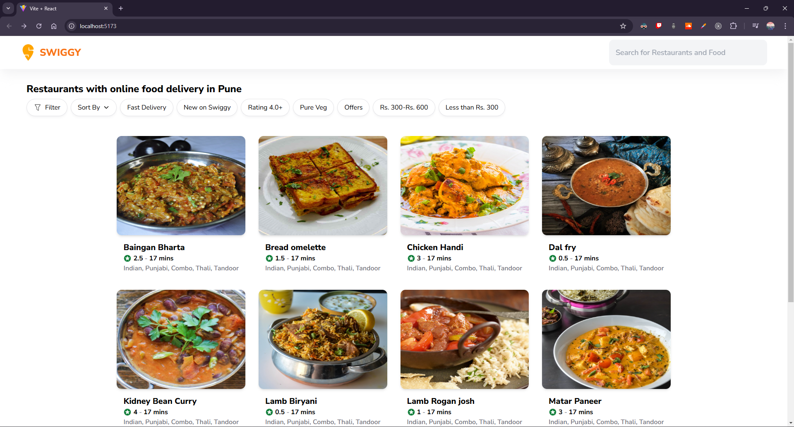
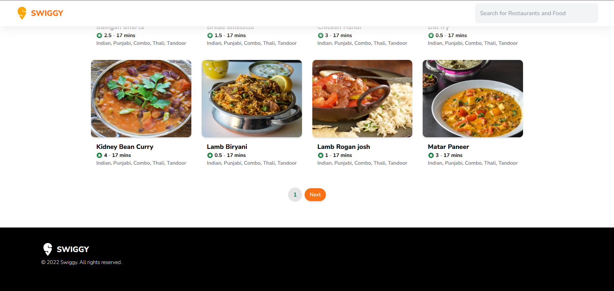
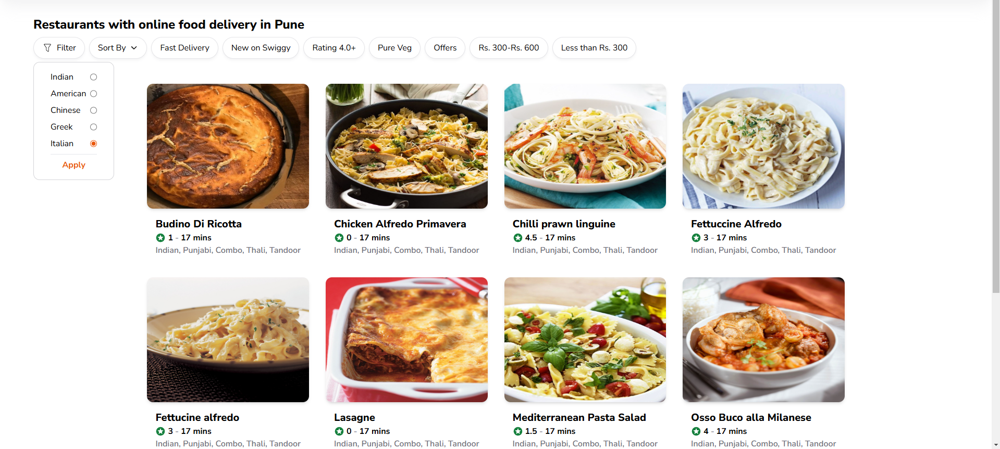
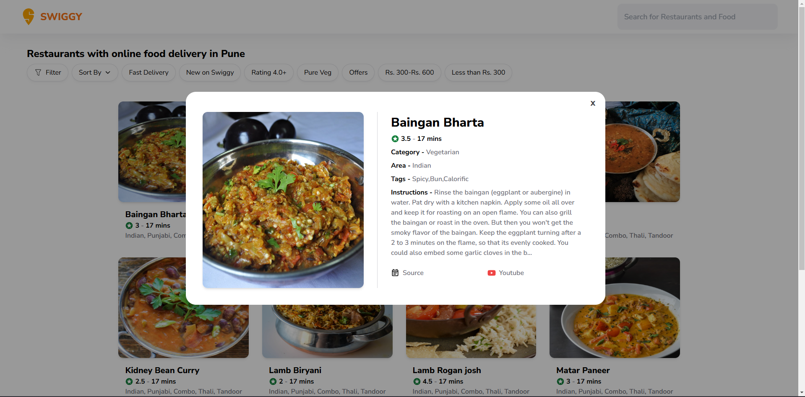

# **Food Menu App 🍔🍕**
- by **Anubhav Sharma**
- 🔗 **Demo Video Link**: [https://youtu.be/2EE0cG-uNhk](https://youtu.be/2EE0cG-uNhk)
- 🔗 **Deploy Link**: [https://anubhav-sharma-frontend-developer.vercel.app/](https://anubhav-sharma-frontend-developer.vercel.app/)

---

### **Table of Contents**
- [**Food Menu App 🍔🍕**](#food-menu-app-)
    - [**Table of Contents**](#table-of-contents)
  - [**Introduction**](#introduction)
  - [**Demo**](#demo)
      - [**Screenshots:**](#screenshots)
  - [**Features**](#features)
  - [**Implementation**](#implementation)
  - [**Tech Stack**](#tech-stack)
  - [**Installation**](#installation)
    - [**Prerequisites**](#prerequisites)
    - [**Step 1**: Clone the Repository](#step-1-clone-the-repository)
    - [**Step 2**: Install Dependencies](#step-2-install-dependencies)
    - [**Step 3**: Run the App Locally](#step-3-run-the-app-locally)
  - [**Usage**](#usage)
  - [**API Reference**](#api-reference)
  - [**Component Hierarchy**](#component-hierarchy)
  - [**Folder Structure**](#folder-structure)
  - [**License**](#license)
  - [**Contact**](#contact)

---

## **Introduction**
This **Swiggy Food Listing App** is a fully responsive web page built using **React**. It allows users to browse food items, filter them by area, sort them alphabetically, and view detailed information via modals. The design is inspired by [Swiggy](https://www.swiggy.com) and utilizes data from [TheMealDB API](https://www.themealdb.com/api.php).

---

## **Demo**
🔗 **Live Demo**: [Click here to view the deployed app](https://anubhav-sharma-frontend-developer.vercel.app/)
🔗 **Demo Video Link**: [https://youtu.be/2EE0cG-uNhk](https://youtu.be/2EE0cG-uNhk)

#### **Screenshots:**








---

## **Features**
- **Responsive Design**: Works seamlessly on all screen sizes.
- **Filters**: Filter food items by area using a dropdown.
- **Sorting**: Sort food items alphabetically in ascending or descending order.
- **Modals**: Detailed food information displayed in a modal upon clicking an item.
- **Pagination**: Easily navigate through the list of food items.
- **Random Ratings**: Displays random ratings for food items.

---

## **Implementation**

- **Responsive Design**: Utilizes Tailwind CSS for a responsive and visually appealing interface.
- **Filters**: Utilizes Zustand for state management and fetches food items based on selected area.
- **Sorting**: Utilizes Zustand for state management and sorts food items alphabetically in ascending or descending order client-side as API does not support sorting.
- **Modals**: Utilizes Zustand for state management and Tailwind CSS for styling, displays detailed food information in a modal upon clicking an item.
- **Pagination**: Utilizes React State for state management and Client-Side Pagination to navigate through the list of food items as API does not support pagination.
- **Random Ratings**: Utilizes the random() function to generate random ratings for food items.

---

## **Tech Stack**
- **Build Tools**: Vite
- **Frontend**: React, Tailwind CSS, React Icons, React Spinners
- **State Management**: Zustand
- **API**: TheMealDB
- **Deployment**: Vercel

---

## **Installation**

To set up the project locally, follow these steps:

### **Prerequisites**
- **Node.js**
- **npm** package manager

### **Step 1**: Clone the Repository
```bash
git clone https://github.com/Satori527/Anubhav-Sharma-Frontend-Developer
cd Anubhav-Sharma-Frontend-Developer
```

### **Step 2**: Install Dependencies
```bash
npm install
```

### **Step 3**: Run the App Locally
```bash
npm run dev
```
The app will be available at `http://localhost:5173`.

---

## **Usage**
1. **Filters**: Select an area from the dropdown to filter food items.
2. **Sorting**: Use the sorting option to arrange items alphabetically in ascending or descending order.
3. **Pagination**: Navigate through different pages using pagination controls.
4. **Modals**: Click on a food card to see more details in a modal.

---

## **API Reference**
Data is fetched from the [TheMealDB API](https://www.themealdb.com/api.php).

**Endpoints Used**:
- **Get all Indian food items**:
  ```
  https://www.themealdb.com/api/json/v1/1/filter.php?a=Indian
  ```
- **Filter by area**:
  ```
  https://www.themealdb.com/api/json/v1/1/list.php?a=list
  ```
- **Get details of a specific meal**:
  ```
  https://www.themealdb.com/api/json/v1/1/lookup.php?i={meal_id}
  ```

---

## **Component Hierarchy**
```
App
├── Header
├── Filter Section
├── Product Grid
│    ├──Product Card
│    └──Modal
│        └──Placeholder
└── Footer
```
---

## **Folder Structure**
```
food-menu-app/
├── public/
├── src/
│   ├── assets/
│   ├── components/
│   ├── pages/
│   ├── store/
│   ├── index.css
│   ├── App.js
│   └── index.js
├── package.json
└── README.md
```
---

## **License**
This project is licensed under the **MIT License** - see the [LICENSE](LICENSE) file for details.

---

## **Contact**
📧 **Email**: [anubhavsharma527@gmail.com](mailto:anubhavsharma527@gmail.com)
💼 **LinkedIn**: [Anubhav Sharma](https://www.linkedin.com/in/anubhav-sharma-983b991ab/)
